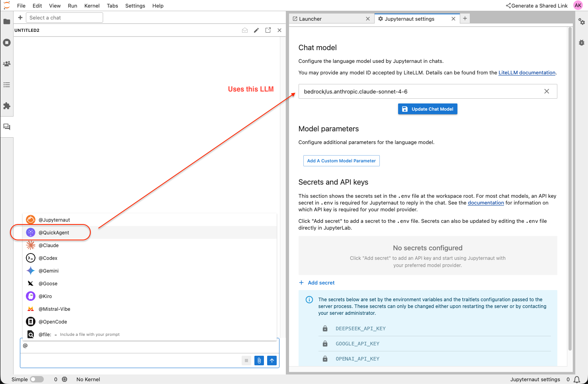
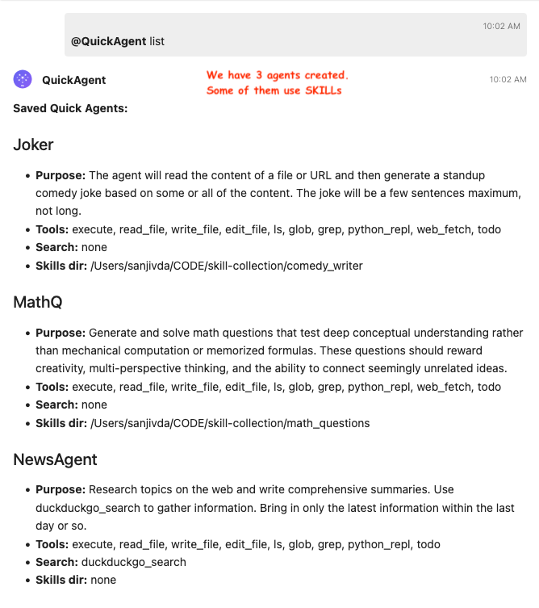
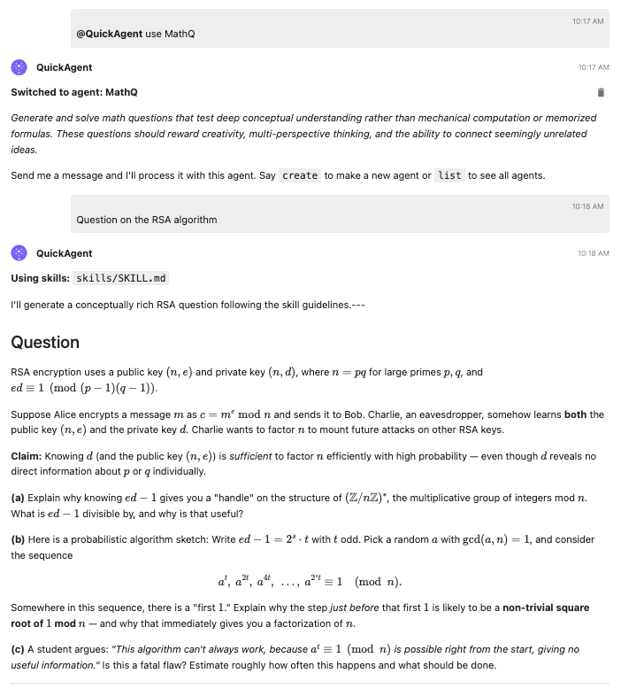
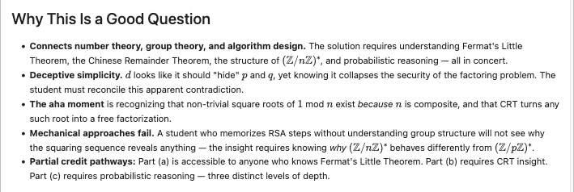

# jupyter-ai-quickagent


A Jupyter AI persona that implements [LangChain Deep Agents](https://github.com/langchain-ai/deepagents) with an interactive agent configuration flow. This can be added as a submodule for `jupyter-ai` in `jupyter-ai-contrib`. Also provided is a one shot interactive installer that installs the contributor version of `jupyter-ai` and all CLIs from major providers. 

<br clear="left">

## Features

- **Interactive agent builder** — step-by-step setup via chat (name, purpose, tools, search, skill files)
- **Shared LLM authentication** — automatically uses the model and credentials configured in Jupyter AI's **Settings > AI Settings** (via LiteLLM), so there is no separate API key setup
- **Persistent agents** — saved to disk and reusable across sessions
- **Built-in tools** — file I/O, shell execution, Python REPL, planning (provided by the Deep Agents framework)
- **Search integration** — DuckDuckGo (built-in, no API key), plus optional Tavily, Wikipedia, arXiv, PubMed
- **Skills directory** — point to a folder of `.md` files with specialized instructions, domain knowledge, or workflows (same as Claude's `--add-dir`)
- **Chat commands** — `@QuickAgent create`, `@QuickAgent list`, `@QuickAgent use <name>`, etc.

## Prerequisites

- **Jupyternaut** (`jupyter_ai_jupyternaut`) must be installed and a chat model must be configured in **Settings > AI Settings**. QuickAgent reuses this model — no environment-variable API keys are needed for the LLM itself.
- **Python >= 3.11**

## Installation

### Within the devrepo

The package will eventually be included in the devrepo workspace as an optional dependency. From the devrepo root:

```bash
just sync          # or: uv sync --extra optional
```

### Standalone

To be done -- the package will be enabled for standalone installation. 

```bash
pip install jupyter_ai_quickagent
```

### Install Everything

In order to install [jupyter-ai](https://github.com/jupyterlab/jupyter-ai) using all the submodules in [jupyter-ai-contrib](https://github.com/jupyter-ai-contrib) you can use the installer provided in this repository, see [install.sh](https://github.com/srdas/jupyter-ai-quickagent/blob/main/install.sh). To use it: 

```
chmod a+x install.sh
./install.sh
```

If you only want to install the various CLIs (e.g., Claude Code, Gemini CLI, Codex CLI, Kiro CLI, OpenCode CLI, etc.) from various providers, you can run the partial installer [install_cli.sh](https://github.com/srdas/jupyter-ai-quickagent/blob/main/install_cli.sh). 

```
chmod a+x install_cli.sh
./install_cli.sh
```

## Quick Start

1. Ensure a chat model is configured in **Settings > AI Settings** (the same one Jupyternaut uses).
2. Start JupyterLab: `just start`
3. Open the Jupyter AI chat panel from the left sidebar.
4. Send `@QuickAgent create` to build your first agent.
5. Follow the five interactive prompts (name, purpose, tools, search tools, skill files).

See [USAGE.md](USAGE.md) for the full walkthrough and command reference. You can see how `QuickAgent` appears as one of the Personas in the chat: 

 

After setting up agents, you will see them in the chat: 

 

### Example

A mathematician colleague, [Professor Dan Ostrov](https://webpages.scu.edu/ftp/dostrov/), wrote a short piece titled ``[What Are Good Math Questions?](https://github.com/srdas/skill-collection/blob/main/math_questions/Good%20Math%20Questions.pdf)'' and this is converted into a `SKILL.md` file stored anywhere on disk and referred to in the skill json file titled `mathq.json` shown later below. You can refer to the [skill file](https://github.com/srdas/skill-collection/blob/main/math_questions/skills/SKILL.md) to see the attributes of a good mathematical question that you want the `MathQ` agent to use.  

Let's use the `MathQ` agent and have it generate a math question:



Here is the answer for the question it asked:


The agent will also tell you why this is a good question conforming to the attributes in the SKILL file. 



Of course, whether this is a good math question eventually is a matter of taste and judgment, which AI agents are not presumed to have. Hopefully, the SKILL file provides enough guidance. 

## How Authentication Works

QuickAgent does **not** manage its own API keys. Instead, it reads the model ID and credentials from Jupyternaut's `ConfigManager`, which is populated through the **Settings > AI Settings** UI. Under the hood this uses [LiteLLM](https://docs.litellm.ai/), so any provider supported there (OpenAI, Anthropic, Azure, Google, AWS Bedrock, etc.) works automatically.

## Development

```bash
cd jupyter-ai-quickagent
just pytest     # run tests
just lint       # run linters
```

## Update `pyproject.toml`

The installler [install.sh](https://github.com/srdas/jupyter-ai-quickagent/blob/main/install.sh) will automatically update the `pyproject.toml` of the `jupyter-ai-devrepo` workspace in the following two places. 

```toml
[project.optional-dependencies]
optional = [
    "jupyter_ai_litellm",
    "jupyter_ai_jupyternaut",
    "jupyter_ai_magic_commands",
    "jupyter_ai_quickagent",
]
```

```toml
[tool.uv.sources]
jupyter_ai = { workspace = true }
jupyter_server_documents = { workspace = true }
jupyterlab_chat = { workspace = true }
jupyter_ai_router = { workspace = true }
jupyter_ai_persona_manager = { workspace = true }
jupyter_ai_litellm = { workspace = true }
jupyter_ai_magic_commands = { workspace = true }
jupyter_ai_chat_commands = { workspace = true }
jupyterlab_commands_toolkit = { workspace = true }
jupyter_ai_jupyternaut = { workspace = true }
jupyter_ai_acp_client = { workspace = true }
jupyter_server_mcp = { workspace = true }
jupyter_ai_tools = { workspace = true }
jupyter_ai_quickagent = { workspace = true }
```

## Using QuickAgent

Please refer to detailed usage instructions in [USAGE.md](https://github.com/srdas/jupyter-ai-quickagent/blob/main/USAGE.md). 

## How are agents stored?

Each agent is saved as a JSON file in `~/.jupyter/jupyter-ai/quickagents/`. The filename is the lowercase agent name (e.g., `mathq.json` for the MathQ agent shown in the screenshot above). Here is an example:

```json
{
  "name": "MathQ",
  "purpose": "Generate and solve math questions that test deep conceptual understanding rather than mechanical computation or memorized formulas.",
  "tools": [
    "execute", "read_file", "write_file", "edit_file",
    "ls", "glob", "grep", "python_repl", "web_fetch", "todo"
  ],
  "search_tools": [],
  "skills_dir": "/path/to/skill-collection/math_questions",
  "system_prompt": ""
}
```

The `@QuickAgent list` command reads this directory and displays all available agents, as shown in the [list_agents.png](#) image above. To remove an agent, simply delete its JSON file from the `quickagents/` folder, or use the `@QuickAgents delete <name of agent>` prompt in the chat panel. 
